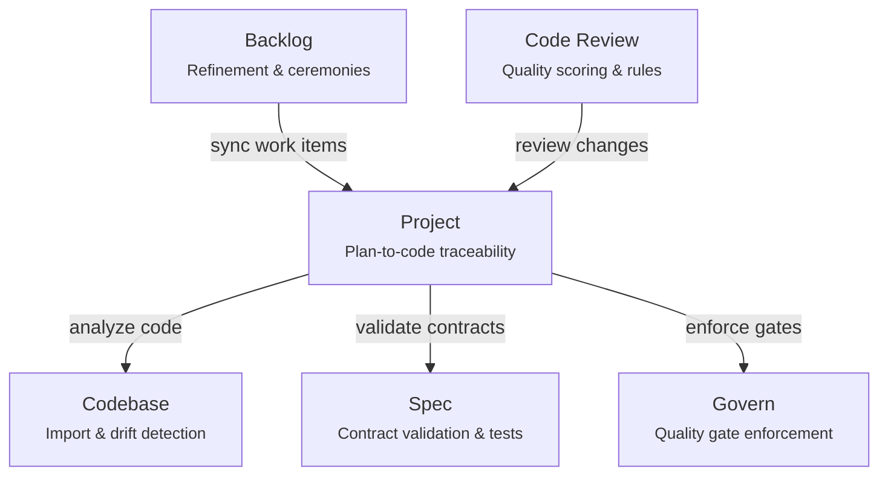

# Choose Your Modules

SpecFact ships as six independent modules. Each solves a distinct problem in your development workflow. You install only what you need.

> **CLI vs AI IDE:** SpecFact CLI is fully deterministic — no AI built in. All commands produce structured, reproducible output. For AI-assisted workflows, each module ships **IDE slash prompts** that you install with `specfact init ide`. These prompts feed CLI output to your IDE's AI (Cursor, Claude Code, VS Code/Copilot, Windsurf, and [10+ more]({{ '/ai-ide-workflow/' | relative_url }})) for interactive analysis and refinement.

## Quick Decision Guide

**"I need to..."** — find your starting point:

| I need to... | Install this | Command surface |
|---|---|---|
| Manage my backlog with template-driven refinement, standups, and sprint planning | **Backlog** | `specfact backlog` |
| Structure my project, link plans to code, and manage dev lifecycle | **Project** | `specfact project`, `specfact plan`, `specfact sync` |
| Import a legacy codebase, detect features, and track spec drift | **Codebase** | `specfact code import`, `specfact code drift` |
| Run governed code reviews with quality scoring and house rules | **Code Review** | `specfact code review` |
| Validate OpenAPI/AsyncAPI contracts and generate test suites | **Spec** | `specfact spec validate`, `specfact spec mock` |
| Enforce quality gates before merge or release | **Govern** | `specfact govern enforce` |

## Module Overview

### Backlog — Template-Driven Backlog Management

**The problem it solves:** Your team wastes hours in refinement meetings, stories lack acceptance criteria, and nobody tracks what changed between sprints.

**What it does:**
- Connects to GitHub Issues or Azure DevOps and syncs your backlog items
- Runs deterministic refinement: detects story type (user story, defect, spike, enabler), scores completeness confidence, validates Definition of Ready
- Automates ceremonies: daily standup summaries, refinement checklists, planning assistance, kanban flow tracking
- Tracks deltas between sprint snapshots: what moved, what's at risk, estimated cost of changes
- Enforces backlog policies per framework (Scrum, Kanban, SAFe)
- Ships IDE slash prompts (via `specfact init ide`) that feed CLI output to your AI IDE for interactive refinement

**Best for:** Any team managing a backlog — from solo developers tracking GitHub issues to enterprise teams running SAFe on Azure DevOps.

```bash
specfact module install nold-ai/specfact-backlog
specfact backlog --help
```

[Full Backlog docs →]({{ '/bundles/backlog/overview/' | relative_url }})

---

### Project — Project Structure and Lifecycle

**The problem it solves:** Your plans live in documents, your code lives in repos, and nothing connects the two. Feature work has no traceable path from idea to release.

**What it does:**
- Creates structured project bundles that link plans to code
- Manages development plans with feature/story tracking aligned to Software Design Documents (SDDs)
- Syncs with external tools: OpenSpec, Spec-Kit, GitHub, Linear, Jira
- Provides a DevOps flow with explicit stages: plan → develop → review → release → monitor
- Imports brownfield codebases with automatic feature detection

**Best for:** Teams that want traceable connections between planning artifacts and code, or anyone modernizing a legacy codebase.

```bash
specfact module install nold-ai/specfact-project
specfact project --help
```

[Full Project docs →]({{ '/bundles/project/overview/' | relative_url }})

---

### Codebase — Code Analysis and Drift Detection

**The problem it solves:** Your implementation drifted from the spec months ago, you have orphaned API endpoints nobody documented, and your test coverage doesn't match your contracts.

**What it does:**
- Imports existing codebases and detects features using AST parsing and semantic analysis
- Measures OpenAPI contract coverage: which endpoints have specs, which don't
- Detects drift between specs and implementation — finds orphaned specs, missing tests, and alignment gaps
- Validates external codebases via sidecar mode (no source modification)
- Runs reproducibility suites: lint, type-check, contract validation, and CrossHair property tests

**Best for:** Teams with existing codebases that need to understand what they have, where specs are missing, and what drifted.

**Requires:** Project module (installed automatically as dependency).

```bash
specfact module install nold-ai/specfact-codebase
specfact code analyze --help
specfact code drift --help
```

[Full Codebase docs →]({{ '/bundles/codebase/overview/' | relative_url }})

---

### Code Review — Governed Quality Reviews

**The problem it solves:** Code reviews are inconsistent, quality is subjective, and there's no measurable record of improvement over time.

**What it does:**
- Runs governed code reviews with deterministic quality scoring (not just linting — structural analysis)
- Bundles Ruff, Semgrep, Pylint, Pytest, Radon, BasedPyright, and CrossHair for comprehensive analysis
- Maintains a review ledger: tracks coins/streaks, violations over time, and team statistics
- Supports house rules per IDE (Cursor, Claude Code, Codex, Windsurf) to enforce consistent quality standards
- Validates TDD gates: did tests come before implementation?

**Best for:** Any developer or team that wants measurable, consistent code quality. Works standalone — no other modules required.

```bash
specfact module install nold-ai/specfact-code-review
specfact code review run --help
```

[Full Code Review docs →]({{ '/bundles/code-review/overview/' | relative_url }})

---

### Spec — Contract Validation and Test Generation

**The problem it solves:** Your OpenAPI specs exist but nobody validates them against the actual code, breaking changes slip through, and writing contract tests is tedious.

**What it does:**
- Validates OpenAPI and AsyncAPI contracts using Specmatic with example verification
- Detects backward-incompatible changes between spec versions before they reach production
- Generates test suites directly from your contracts — no manual test writing
- Spins up mock servers from specs for frontend development and integration testing
- Bootstraps and validates Software Design Document (SDD) constitutions

**Best for:** Teams with API contracts that need validation, backward compatibility checks, and generated test suites.

**Requires:** Project module (installed automatically as dependency).

```bash
specfact module install nold-ai/specfact-spec
specfact spec validate --help
specfact spec mock --help
```

[Full Spec docs →]({{ '/bundles/spec/overview/' | relative_url }})

---

### Govern — Quality Gates and Enforcement

**The problem it solves:** Quality standards exist on paper but nothing enforces them before merge or release. Patches are applied manually and inconsistently.

**What it does:**
- Enforces quality gates at configurable strictness levels: minimal, balanced, or strict
- Validates SDD compliance: checks bundle state, thresholds, and frozen sections before promotion
- Manages patches with explicit preview → apply → verify flow and write authorization gates
- Works in both interactive mode and CI/CD pipelines

**Best for:** Teams that need automated quality enforcement before merges and releases, especially in CI/CD pipelines.

**Requires:** Project module (installed automatically as dependency).

```bash
specfact module install nold-ai/specfact-govern
specfact govern enforce --help
```

[Full Govern docs →]({{ '/bundles/govern/overview/' | relative_url }})

---

## Side-by-Side Comparison

| | Backlog | Project | Codebase | Code Review | Spec | Govern |
|---|---|---|---|---|---|---|
| **One-line USP** | Template-driven backlog refinement & ceremonies | Plan-to-code traceability | Legacy import & drift detection | Governed quality scoring | Contract validation & test gen | Quality gate enforcement |
| **Dependencies** | None | None | Project | None | Project | Project |
| **Works standalone** | Yes | Yes | No | Yes | No | No |
| **Connects to external tools** | GitHub, Azure DevOps | GitHub, Linear, Jira, OpenSpec | — | — | Specmatic | — |
| **CI/CD ready** | Yes | Yes | Yes | Yes (score-only mode) | Yes | Yes (non-interactive) |
| **Solo developer** | Great | Great | Great | Great | Useful | Optional |
| **Team use** | Essential | Essential | Very useful | Essential | Very useful | Very useful |
| **Enterprise** | Essential | Essential | Essential | Essential | Essential | Essential |

## Recommended Install Profiles

### Solo Developer — Start simple

```bash
specfact init --profile solo-developer
# Installs: backlog + code-review
```

You get template-driven backlog management for your GitHub issues and governed code reviews. Install IDE slash prompts with `specfact init ide` for AI-assisted workflows. Add more modules as your project grows.

### Small Team — Full workflow

```bash
specfact init --install backlog,project,code-review,spec
```

Covers backlog management, plan-to-code traceability, code reviews, and contract validation. Your team gets shared quality standards through house rules.

### Enterprise — Everything

```bash
specfact init --install all
```

All six modules. Adds governance enforcement, codebase drift detection, and the full compliance pipeline. Pair with [Enterprise Configuration]({{ '/team-and-enterprise/enterprise-config/' | relative_url }}) for multi-repo setups.

## How Modules Work Together



**Backlog** feeds work items into **Project** plans. **Project** connects plans to code that **Codebase** analyzes for drift. **Spec** validates the contracts that **Project** references. **Code Review** scores quality on every change. **Govern** enforces gates before merge and release.

---

## Customization Options by Module

For intermediate and advanced users — each module provides configuration hooks to adapt behavior to your team's workflow.

### Backlog Customizations

| What | How | Use case |
|---|---|---|
| **Field mapping** | `specfact backlog map-fields` or `.specfact/backlog-config.yaml` | Azure DevOps custom process templates with non-standard fields |
| **Adapter selection** | `.specfact/backlog-config.yaml` | Switch between GitHub Issues and Azure DevOps |
| **Policy framework** | `.specfact/policy.yaml` | Choose Scrum, Kanban, SAFe, or mixed framework rules |
| **Refinement templates** | Provider + framework + persona resolution | Custom refinement templates per story type (used by CLI and IDE slash prompts) |
| **Ceremony config** | `.specfact/standup.yaml` | Customize standup format, sprint boundaries, and output |

[Backlog deep dives →]({{ '/bundles/backlog/overview/' | relative_url }}) · [Custom Field Mapping guide →]({{ '/guides/custom-field-mapping/' | relative_url }})

### Project Customizations

| What | How | Use case |
|---|---|---|
| **Sync bridges** | `specfact sync bridge` config | Connect to GitHub, Linear, Jira, OpenSpec, Spec-Kit |
| **Personas** | `specfact project init-personas` | Map team roles to project bundle access |
| **Import entry points** | `specfact code import --entry-point` | Specify monorepo roots for brownfield analysis |
| **DevOps stages** | Stage action configuration | Customize the plan → develop → review → release flow |

[Project deep dives →]({{ '/bundles/project/overview/' | relative_url }})

### Codebase Customizations

| What | How | Use case |
|---|---|---|
| **Framework extractors** | Auto-detected (Django, FastAPI, Flask, DRF) | Framework-specific feature detection during import |
| **Confidence thresholds** | CLI flags | Tune sensitivity of feature detection |
| **CrossHair depth** | `--crosshair-timeout` | Control property test exploration time |
| **Sidecar workspace** | `specfact code validate sidecar init` | Validate external repos without modifying source |

[Codebase deep dives →]({{ '/bundles/codebase/overview/' | relative_url }})

### Code Review Customizations

| What | How | Use case |
|---|---|---|
| **House rules** | `specfact code review rules init` | Per-IDE quality rules (Cursor, Claude Code, Codex, Windsurf) |
| **Review scope** | `--scope changed` vs `--scope full` | Review only changed files or entire codebase |
| **Test inclusion** | `--include-tests` / `--exclude-tests` | Control whether test files are reviewed |
| **Score-only mode** | `--score-only` | CI/CD integration — just the score, no details |
| **Ledger management** | `specfact code review ledger` | Track quality trends, streaks, and team stats |

[Code Review deep dives →]({{ '/bundles/code-review/overview/' | relative_url }})

### Spec Customizations

| What | How | Use case |
|---|---|---|
| **Validation caching** | `--force-refresh` | Control when cached validation results expire |
| **Mock server port** | `--port` | Run multiple mock servers in parallel |
| **Test output directory** | `--output-dir` | Custom location for generated test suites |
| **SDD constitution** | `specfact spec sdd constitution` | Customize Software Design Document templates |
| **Generation prompts** | IDE persona configuration | Customize AI-generated contract prompts per IDE |

[Spec deep dives →]({{ '/bundles/spec/overview/' | relative_url }})

### Govern Customizations

| What | How | Use case |
|---|---|---|
| **Enforcement presets** | `--preset minimal/balanced/strict` | Choose strictness level for quality gates |
| **SDD manifest path** | `--sdd-manifest` | Point to custom SDD location |
| **Output format** | `--format yaml/json/markdown` | Choose report format for CI/CD integration |
| **Non-interactive mode** | `--yes` | Automated pipelines — skip all prompts |
| **Dry-run patches** | `--dry-run` | Preview patch effects before applying |

[Govern deep dives →]({{ '/bundles/govern/overview/' | relative_url }})

---

## Next Steps

- [Installation]({{ '/getting-started/installation/' | relative_url }}) — Install SpecFact CLI and your chosen modules
- [First Steps]({{ '/getting-started/first-steps/' | relative_url }}) — Run your first commands
- [Module Bootstrap Checklist]({{ '/getting-started/module-bootstrap-checklist/' | relative_url }}) — Verify your setup
- [Cross-Module Chains]({{ '/guides/cross-module-chains/' | relative_url }}) — See how modules work together in real workflows
