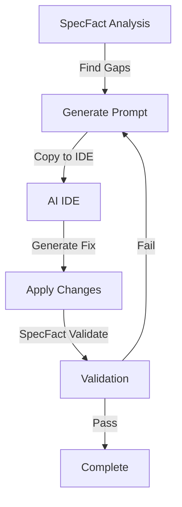

# AI IDE Workflow Guide

> **Complete guide to using SpecFact CLI with AI IDEs (Cursor, VS Code + Copilot, Claude Code, etc.)**

---

## Overview

SpecFact CLI integrates with AI-assisted IDEs through slash commands that enable a seamless workflow: **SpecFact finds gaps → AI IDE fixes them → SpecFact validates**. This guide explains the complete workflow from setup to validation.

**Key Benefits**:

- ✅ **You control the AI** - Use your preferred AI model
- ✅ **SpecFact validates** - Ensure AI-generated code meets contracts
- ✅ **No lock-in** - Works with any AI IDE
- ✅ **CLI-first** - Works offline, no account required

---

## Setup Process

### Step 1: Initialize IDE Integration

Run the `init ide` command in your repository:

```bash
# Auto-detect IDE
specfact init

# Or specify IDE explicitly
specfact init ide --ide cursor
specfact init ide --ide vscode
specfact init ide --ide copilot

# Install required packages for contract enhancement
specfact init ide --ide cursor --install-deps
```

**What it does**:

1. Detects your IDE (or uses `--ide` flag)
2. Copies prompt templates from `resources/prompts/` to IDE-specific location
3. Creates/updates IDE settings if needed
4. Makes slash commands available in your IDE
5. Optionally installs required packages (`beartype`, `icontract`, `crosshair-tool`, `pytest`)

**Related**: [IDE Integration Guide](ide-integration.md) - Complete setup instructions

---

## Available Slash Commands

Once initialized, the following slash commands are available in your IDE:

### Core Workflow Commands

| Slash Command | Purpose | Equivalent CLI Command |
|---------------|---------|------------------------|
| `/specfact.01-import` | Import from codebase | `specfact code import` |
| `/specfact.02-plan` | Plan management | `specfact plan init/add-feature/add-story` |
| `/specfact.03-review` | Review plan | `specfact plan compare` |
| `/specfact.04-sdd` | Create SDD manifest | `specfact enforce sdd` |
| `/specfact.05-enforce` | SDD enforcement | `specfact enforce sdd` |
| `/specfact.06-sync` | Sync operations | `specfact sync bridge` |
| `/specfact.07-contracts` | Contract management | `specfact generate contracts-prompt` |

### Advanced Commands

| Slash Command | Purpose | Equivalent CLI Command |
|---------------|---------|------------------------|
| `/specfact.compare` | Compare plans | `specfact plan compare` |
| `/specfact.validate` | Validation suite | `specfact repro` |
| `/specfact.backlog-refine` | Backlog refinement (AI IDE interactive loop) | `specfact backlog refine github \| ado` |

For an end-to-end tutorial on backlog refine with your AI IDE (story quality, underspecification, DoR, custom templates), see **[Tutorial: Backlog Refine with AI IDE](../getting-started/tutorial-backlog-refine-ai-ide.md)**.

**Related**: [IDE Integration - Available Slash Commands](ide-integration.md#available-slash-commands)

---

## Complete Workflow: Prompt Generation → AI IDE → Validation Loop

### Workflow Overview



### Step-by-Step Workflow

#### 1. Run SpecFact Analysis

```bash
# Import from codebase
specfact code import my-project --repo .

# Run validation to find gaps
specfact repro --verbose
```

#### 2. Generate AI-Ready Prompt

```bash
# Generate fix prompt for a specific gap
specfact generate fix-prompt GAP-001 --bundle my-project

# Or generate contract prompt
specfact generate contracts-prompt --bundle my-project --feature FEATURE-001

# Or generate test prompt
specfact generate test-prompt src/auth/login.py --bundle my-project
```

#### 3. Use AI IDE to Apply Fixes

**In Cursor / VS Code / Copilot**:

1. Open the generated prompt file
2. Copy the prompt content
3. Paste into AI IDE chat
4. AI generates the fix
5. Review and apply the changes

**Example**:

```bash
# After generating prompt
cat .specfact/prompts/fix-prompt-GAP-001.md

# Copy content to AI IDE chat
# AI generates fix
# Apply changes to code
```

#### 4. Validate with SpecFact

```bash
# Check contract coverage
specfact contract coverage --bundle my-project

# Run validation
specfact repro --verbose

# Enforce SDD compliance
specfact enforce sdd --bundle my-project
```

#### 5. Iterate if Needed

If validation fails, return to step 2 and generate a new prompt for the remaining issues.

---

## Integration with Command Chains

The AI IDE workflow integrates with several command chains:

### AI-Assisted Code Enhancement Chain

**Workflow**: `generate contracts-prompt` → [AI IDE] → `contracts-apply` → `contract coverage` → `code repro`

**Related**: [AI-Assisted Code Enhancement Chain](command-chains.md#7-ai-assisted-code-enhancement-chain-emerging)

### Test Generation from Specifications Chain

**Workflow**: `generate test-prompt` → [AI IDE] → `spec generate-tests` → `pytest`

**Related**: [Test Generation from Specifications Chain](command-chains.md#8-test-generation-from-specifications-chain-emerging)

### Gap Discovery & Fixing Chain

**Workflow**: `code repro --verbose` → `generate fix-prompt` → [AI IDE] → `govern enforce sdd`

**Related**: [Gap Discovery & Fixing Chain](command-chains.md#9-gap-discovery--fixing-chain-emerging)

---

## Example: Complete AI IDE Workflow

### Scenario: Add Contracts to Existing Code

```bash
# 1. Analyze codebase
specfact code import legacy-api --repo .

# 2. Find gaps
specfact repro --verbose

# 3. Generate contract prompt
specfact generate contracts-prompt --bundle legacy-api --feature FEATURE-001

# 4. [In AI IDE] Use slash command or paste prompt
# /specfact.generate-contracts-prompt legacy-api FEATURE-001
# AI generates contracts
# Apply contracts to code

# 5. Validate
specfact contract coverage --bundle legacy-api
specfact repro --verbose
specfact enforce sdd --bundle legacy-api
```

---

## Supported IDEs

SpecFact CLI supports the following AI IDEs:

- ✅ **Cursor** - `.cursor/commands/`
- ✅ **VS Code / GitHub Copilot** - `.github/prompts/` + `.vscode/settings.json`
- ✅ **Claude Code** - `.claude/commands/`
- ✅ **Gemini CLI** - `.gemini/commands/`
- ✅ **Qwen Code** - `.qwen/commands/`
- ✅ **opencode** - `.opencode/command/`
- ✅ **Windsurf** - `.windsurf/workflows/`
- ✅ **Kilo Code** - `.kilocode/workflows/`
- ✅ **Auggie** - `.augment/commands/`
- ✅ **Roo Code** - `.roo/commands/`
- ✅ **CodeBuddy** - `.codebuddy/commands/`
- ✅ **Amp** - `.agents/commands/`
- ✅ **Amazon Q Developer** - `.amazonq/prompts/`

**Related**: [IDE Integration - Supported IDEs](ide-integration.md#supported-ides)

---

## Troubleshooting

### Slash Commands Not Showing

**Issue**: Slash commands don't appear in IDE

**Solution**:

```bash
# Re-initialize with force
specfact init ide --ide cursor --force
```

**Related**: [IDE Integration - Troubleshooting](ide-integration.md#troubleshooting)

---

### AI-Generated Code Fails Validation

**Issue**: AI-generated code doesn't pass SpecFact validation

**Solution**:

1. Review validation errors
2. Generate a new prompt with more specific requirements
3. Re-run AI generation
4. Validate again

---

## See Also

- [IDE Integration Guide](ide-integration.md) - Complete setup and configuration
- [Command Chains Reference](command-chains.md) - Complete workflows
- [Common Tasks Index](common-tasks.md) - Quick reference
- [Generate Commands Reference](../reference/commands.md#generate---generate-artifacts) - Command documentation
