# Command Chains Reference

> **Complete guide to SpecFact CLI command chains and workflows**

---

## Overview

Command chains are sequences of SpecFact CLI commands that work together to achieve specific goals. Each chain represents a complete workflow from start to finish, with decision points and expected outcomes documented.

**Why use command chains?** Instead of learning individual commands in isolation, command chains show you how to combine commands to solve real-world problems. They provide context, decision points, and links to detailed guides.

## Module System Context

These chains run on SpecFact's module-first architecture:

- Core runtime handles lifecycle, registry, contracts, and orchestration.
- Feature command logic is implemented in module-local command groups.
- Legacy command paths are compatibility shims during migration windows.

This keeps chains stable while modules evolve independently.

This document covers all 10 identified command chains:

- **7 Mature Chains**: Well-established workflows with comprehensive documentation
- **3 Emerging Chains**: AI-assisted workflows that integrate with IDE slash commands

---

## When to Use Which Chain?

Use this decision tree to find the right chain for your use case:

```
Start: What do you want to accomplish?

├─ Modernize existing legacy code?
│  └─ → Brownfield Modernization Chain
│
├─ Plan a new feature from scratch?
│  └─ → Greenfield Planning Chain
│
├─ Integrate with Spec-Kit, OpenSpec, or other tools?
│  └─ → External Tool Integration Chain
│
├─ Develop or validate API contracts?
│  └─ → API Contract Development Chain
│
├─ Validate external codebase without modifying source?
│  └─ → Sidecar Validation Chain
│
├─ Promote a plan through stages to release?
│  └─ → Plan Promotion & Release Chain
│
├─ Compare code against specifications?
│  └─ → Code-to-Plan Comparison Chain
│
├─ Use AI to enhance code with contracts?
│  └─ → AI-Assisted Code Enhancement Chain (Emerging)
│
├─ Generate tests from specifications?
│  └─ → Test Generation from Specifications Chain (Emerging)
│
└─ Fix gaps discovered during analysis?
   └─ → Gap Discovery & Fixing Chain (Emerging)
```

---

## 1. Brownfield Modernization Chain

**Goal**: Modernize legacy code safely by extracting specifications, creating plans, and enforcing contracts.

**When to use**: You have existing code that needs modernization, refactoring, or migration.

**Command Sequence**:

```bash
# Step 1: Extract specifications from legacy code
specfact code import legacy-api --repo .

# Step 2: Review the extracted plan
specfact plan review legacy-api

# Step 3: Update features based on review findings
specfact plan update-feature --bundle legacy-api --feature <feature-id>

# Step 4: Enforce SDD (Spec-Driven Development) compliance
specfact enforce sdd --bundle legacy-api

# Step 5: Run full validation suite
specfact repro --verbose
```

**Workflow Diagram**:

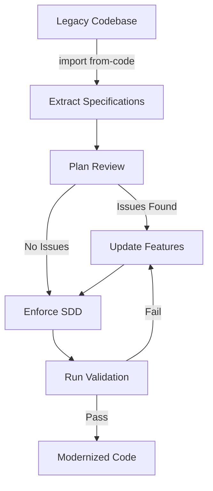

**Decision Points**:

- **After `import from-code`**: Review the extracted plan. If features are incomplete or incorrect, use `plan update-feature` to refine them.
- **After `plan review`**: If ambiguities are found, resolve them before proceeding to enforcement.
- **After `enforce sdd`**: If compliance fails, update the plan and re-run enforcement.
- **After `repro`**: If validation fails, fix issues and re-run the chain from the appropriate step.

**Expected Outcomes**:

- Complete specification extracted from legacy code
- Plan bundle with features, stories, and acceptance criteria
- SDD-compliant codebase
- Validated contracts and tests

**Related Guides**:

- [Brownfield Engineer Guide](brownfield-engineer.md) - Complete walkthrough
- [Brownfield Journey](brownfield-journey.md) - Real-world examples
- [Brownfield FAQ](brownfield-faq.md) - Common questions

---

## 2. Greenfield Planning Chain

**Goal**: Plan new features from scratch using Spec-Driven Development principles.

**When to use**: You're starting a new feature or project and want to plan it properly before coding.

**Command Sequence**:

```bash
# Step 1: Initialize a new plan bundle
specfact plan init new-feature --interactive

# Step 2: Add features to the plan
specfact plan add-feature --bundle new-feature --name "User Authentication"

# Step 3: Add user stories to features
specfact plan add-story --bundle new-feature --feature <feature-id> --story "As a user, I want to log in"

# Step 4: Review the plan for completeness
specfact plan review new-feature

# Step 5: Harden the plan (finalize before implementation)
specfact plan harden --bundle new-feature

# Step 6: Generate contracts from the plan
specfact generate contracts --bundle new-feature

# Step 7: Enforce SDD compliance
specfact enforce sdd --bundle new-feature
```

**Workflow Diagram**:

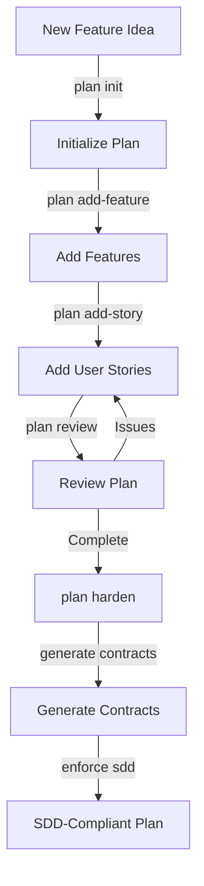

**Decision Points**:

- **After `plan init`**: Choose interactive mode to get guided prompts, or use flags for automation.
- **After `plan add-feature`**: Add multiple features before adding stories, or add stories immediately.
- **After `plan review`**: If ambiguities are found, add more details or stories before hardening.
- **After `plan harden`**: Once hardened, the plan is locked. Generate contracts before enforcement.

**Expected Outcomes**:

- Complete plan bundle with features and stories
- Generated contracts ready for implementation
- SDD-compliant plan ready for development

**Related Guides**:

- [Agile/Scrum Workflows](agile-scrum-workflows.md) - Persona-based planning
- [Workflows Guide](workflows.md) - General workflow patterns

---

## 3. External Tool Integration Chain

**Goal**: Integrate SpecFact with external tools like Spec-Kit, OpenSpec, or DevOps backlog tools (GitHub Issues, Linear, Jira).

**When to use**: You want to sync specifications between SpecFact and other tools, import from external sources, or integrate SpecFact into your agile DevOps workflows.

**Command Sequence**:

```bash
# For Code/Spec Adapters (Spec-Kit, OpenSpec, generic-markdown):
# Step 1: Import from external tool via bridge adapter
specfact import from-bridge --repo . --adapter speckit --write

# Step 2: Review the imported plan
specfact plan review <bundle-name>

# Step 3: Set up bidirectional sync (optional)
specfact sync bridge --adapter speckit --bundle <bundle-name> --bidirectional --watch

# Step 4: Enforce SDD compliance
specfact enforce sdd --bundle <bundle-name>

# For Backlog Adapters (GitHub Issues, ADO, Linear, Jira) - NEW FEATURE:
# Step 1: Export OpenSpec change proposals to GitHub Issues
specfact sync bridge --adapter github --bidirectional --repo-owner owner --repo-name repo

# Step 2: Import GitHub Issues as change proposals (if needed)
# (Automatic when using --bidirectional)

# Step 3: Track code changes automatically
specfact sync bridge --adapter github --track-code-changes --repo-owner owner --repo-name repo
```

**Workflow Diagram**:

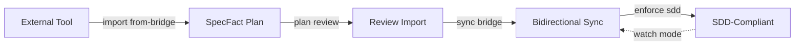

**Decision Points**:

- **After `import from-bridge`**: Review the imported plan. If it needs refinement, use `plan update-feature`.
- **Bidirectional sync**: Use `--watch` mode for continuous synchronization, or run sync manually as needed.
- **Adapter selection**: 
  - **Code/Spec adapters** (use `import from-bridge`): `speckit`, `openspec`, `generic-markdown`
  - **Backlog adapters** (use `sync bridge`): `github`, `ado`, `linear`, `jira`
  - **Note**: Backlog adapters (GitHub Issues, ADO, Linear, Jira) use `sync bridge` for bidirectional synchronization, not `import from-bridge`. The `import from-bridge` command is specifically for importing entire code/spec projects.

**Expected Outcomes**:

- Specifications imported from external tool
- Bidirectional synchronization (if enabled)
- SDD-compliant integrated workflow

**Related Guides**:

- [Spec-Kit Journey](speckit-journey.md) - Complete Spec-Kit integration guide
- [OpenSpec Journey](openspec-journey.md) - OpenSpec integration guide
- [DevOps Adapter Integration](devops-adapter-integration.md) - GitHub Issues, ADO, Linear, Jira
- [Bridge Adapters Reference](../reference/commands.md#sync-bridge) - Command reference

---

## 4. API Contract Development Chain

**Goal**: Develop, validate, and test API contracts using SpecFact and Specmatic integration.

**When to use**: You're developing REST APIs and want to ensure contract compliance and backward compatibility.

**Command Sequence**:

```bash
# Step 1: Validate API specification
specfact spec validate --spec openapi.yaml

# Step 2: Check backward compatibility
specfact spec backward-compat --spec openapi.yaml --previous-spec openapi-v1.yaml

# Step 3: Generate tests from specification
specfact spec generate-tests --spec openapi.yaml --output tests/

# Step 4: Generate mock server (optional)
specfact spec mock --spec openapi.yaml --port 8080

# Step 5: Verify contracts at runtime
specfact contract verify --bundle api-bundle
```

**Workflow Diagram**:

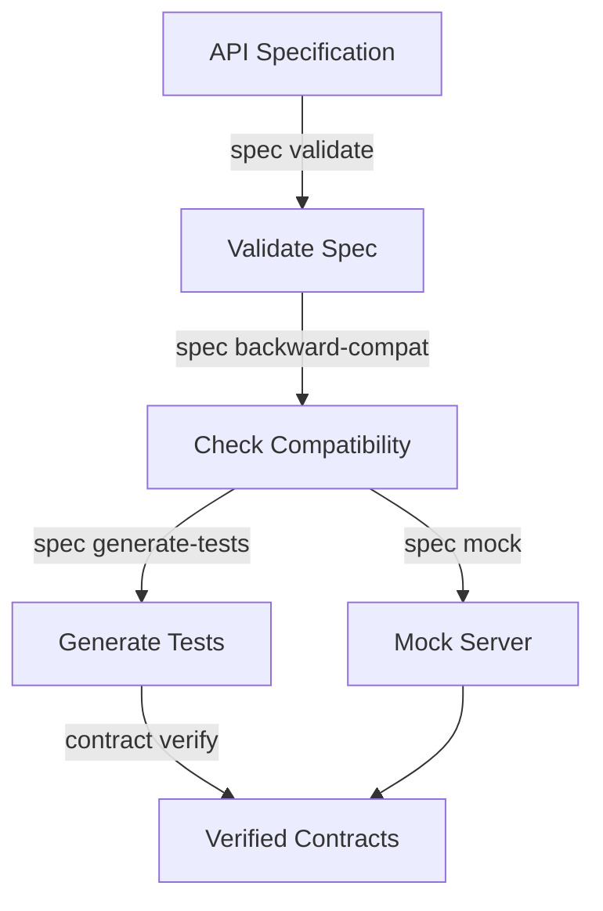

**Decision Points**:

- **After `spec validate`**: If validation fails, fix the specification before proceeding.
- **Backward compatibility**: Check compatibility before releasing new API versions.
- **Mock server**: Use mock server for testing clients before implementation is complete.
- **Contract verification**: Run verification in CI/CD to catch contract violations early.

**Expected Outcomes**:

- Validated API specification
- Backward compatibility verified
- Generated tests from specification
- Runtime contract verification

**Related Guides**:

- [Specmatic Integration](specmatic-integration.md) - Complete Specmatic guide
- [Contract Testing Workflow](contract-testing-workflow.md) - Contract testing patterns

---

## 5. Sidecar Validation Chain

**Goal**: Validate external codebases (libraries, APIs, frameworks) without modifying source code.

**When to use**: You need to validate third-party libraries, legacy codebases, or APIs where you don't control the implementation.

**Command Sequence**:

```bash
# Step 1: Initialize sidecar workspace
specfact validate sidecar init <bundle-name> <repo-path>

# Step 2: Run sidecar validation workflow
specfact validate sidecar run <bundle-name> <repo-path>

# Step 3: Review validation results
# Results are saved to .specfact/projects/<bundle>/reports/sidecar/
```

**Workflow Diagram**:

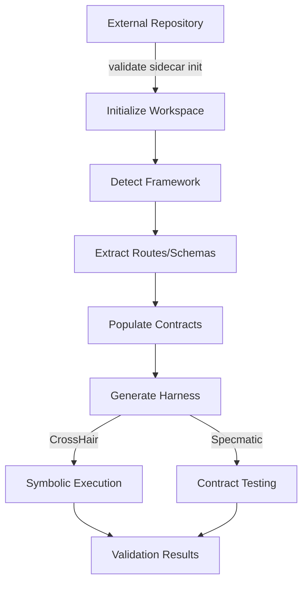

**Decision Points**:

- **After `validate sidecar init`**: Review detected framework and configuration. Adjust if needed.
- **Framework detection**: System automatically detects Django, FastAPI, DRF, Flask, or pure Python. Verify detection is correct.
- **Tool execution**: Use `--no-run-crosshair` or `--no-run-specmatic` to skip specific tools if not needed.
- **After `validate sidecar run`**: Review validation results. Fix issues in contracts or harness if needed.

**Expected Outcomes**:

- Sidecar workspace initialized with framework-specific configuration
- Routes and schemas extracted from framework patterns
- OpenAPI contracts populated with extracted data
- CrossHair harness generated from contracts
- Validation results (CrossHair analysis, Specmatic testing)
- Reports saved to sidecar reports directory

**Related Guides**:

- [Sidecar Validation Guide](sidecar-validation.md) - Complete sidecar validation walkthrough
- [Command Reference - Validate Commands](../reference/commands.md#validate---validation-commands) - Command reference
- [Framework Detection](../reference/commands.md#framework-detection) - Supported frameworks

---

## 6. Plan Promotion & Release Chain

**Goal**: Promote a plan through stages (draft → review → approved → released) and manage versions.

**When to use**: You have a completed plan and want to promote it through your organization's approval process.

**Command Sequence**:

```bash
# Step 1: Review the plan before promotion
specfact plan review <bundle-name>

# Step 2: Enforce SDD compliance
specfact enforce sdd --bundle <bundle-name>

# Step 3: Promote the plan to next stage
specfact plan promote --bundle <bundle-name> --stage <next-stage>

# Step 4: Bump version when releasing
specfact project version bump --bundle <bundle-name> --type <major|minor|patch>
```

**Workflow Diagram**:

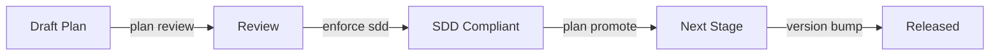

**Decision Points**:

- **After `plan review`**: If issues are found, fix them before promotion.
- **SDD enforcement**: Ensure compliance before promoting to production stages.
- **Version bumping**: Choose appropriate version type (major/minor/patch) based on changes.

**Expected Outcomes**:

- Plan promoted through approval stages
- Version bumped appropriately
- Release-ready plan bundle

**Related Guides**:

- [Agile/Scrum Workflows](agile-scrum-workflows.md) - Stage management
- [Project Version Management](../reference/commands.md#project-version) - Version commands

---

## 7. Code-to-Plan Comparison Chain

**Goal**: Detect and resolve drift between code and specifications.

**When to use**: You want to ensure your code matches your specifications, or detect when code has diverged.

**Command Sequence**:

```bash
# Step 1: Import current code state
specfact code import current-state --repo .

# Step 2: Compare code against plan
specfact plan compare --bundle <plan-bundle> --code-vs-plan

# Step 3: Detect drift
specfact drift detect --bundle <bundle-name>

# Step 4: Sync repository (if drift found)
specfact sync repository --bundle <bundle-name> --direction <code-to-plan|plan-to-code>
```

**Workflow Diagram**:

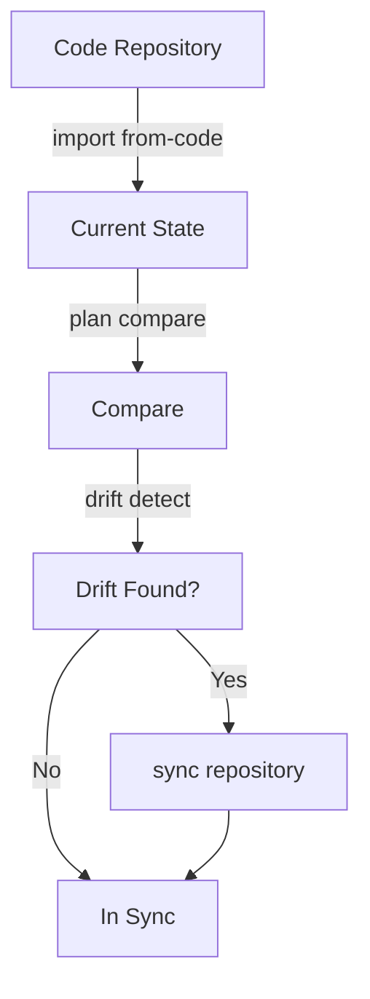

**Decision Points**:

- **After `plan compare`**: Review the comparison results to understand differences.
- **Drift detection**: If drift is detected, decide whether to sync code-to-plan or plan-to-code.
- **Sync direction**: Choose `code-to-plan` to update plan from code, or `plan-to-code` to update code from plan.

**Expected Outcomes**:

- Code and plan synchronized
- Drift detected and resolved
- Consistent state between code and specifications

**Related Guides**:

- [Drift Detection](../reference/commands.md#drift-detect) - Command reference
- [Plan Comparison](../reference/commands.md#plan-compare) - Comparison options

---

## 8. AI-Assisted Code Enhancement Chain (Emerging)

**Goal**: Use AI IDE integration to enhance code with contracts and validate them.

**When to use**: You want to add contracts to existing code using AI assistance in your IDE.

**Command Sequence**:

```bash
# Step 1: Generate contract prompt for AI IDE
specfact generate contracts-prompt --bundle <bundle-name> --feature <feature-id>

# Step 2: [In AI IDE] Use slash command to apply contracts
# /specfact-cli/contracts-apply <prompt-file>

# Step 3: Check contract coverage
specfact contract coverage --bundle <bundle-name>

# Step 4: Run validation
specfact repro --verbose
```

**Workflow Diagram**:

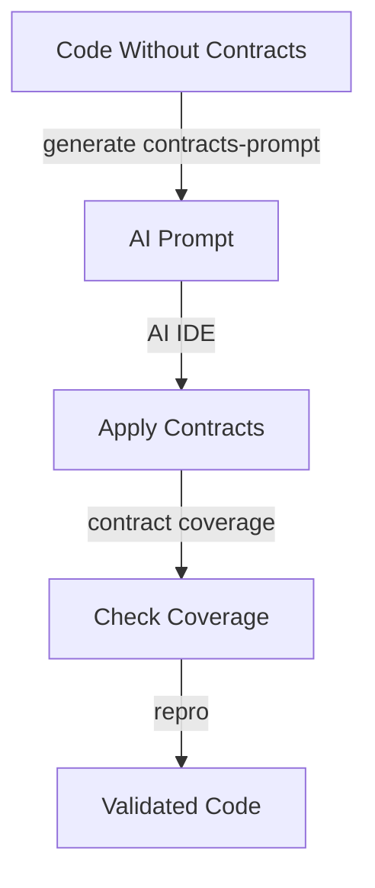

**Decision Points**:

- **After generating prompt**: Review the prompt in your AI IDE before applying.
- **Contract coverage**: Ensure coverage meets your requirements before validation.
- **Validation**: If validation fails, review and fix contracts, then re-run.

**Expected Outcomes**:

- Contracts added to code via AI assistance
- Contract coverage verified
- Validated enhanced code

**Related Guides**:

- [AI IDE Workflow](ai-ide-workflow.md) - Complete AI IDE integration guide
- [IDE Integration](ide-integration.md) - General IDE setup

---

## 9. Test Generation from Specifications Chain (Emerging)

**Goal**: Generate tests from specifications using AI assistance.

**When to use**: You have specifications and want to generate comprehensive tests automatically.

**Command Sequence**:

```bash
# Step 1: Generate test prompt for AI IDE
specfact generate test-prompt --bundle <bundle-name> --feature <feature-id>

# Step 2: [In AI IDE] Use slash command to generate tests
# /specfact-cli/test-generate <prompt-file>

# Step 3: Generate tests from specification
specfact spec generate-tests --spec <spec-file> --output tests/

# Step 4: Run tests
pytest tests/
```

**Workflow Diagram**:

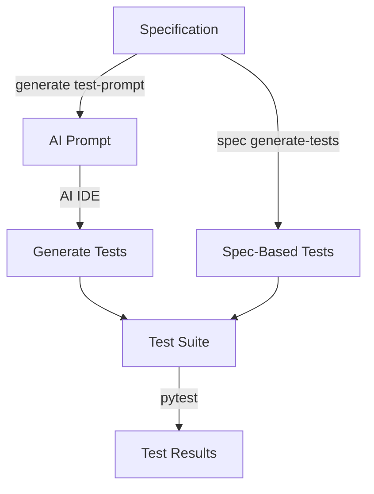

**Decision Points**:

- **Test generation method**: Use AI IDE for custom tests, or `spec generate-tests` for specification-based tests.
- **Test coverage**: Review generated tests to ensure they cover all scenarios.
- **Test execution**: Run tests in CI/CD for continuous validation.

**Expected Outcomes**:

- Comprehensive test suite generated
- Tests validated and passing
- Specification coverage verified

**Related Guides**:

- [AI IDE Workflow](ai-ide-workflow.md) - AI IDE integration
- [Testing Workflow](contract-testing-workflow.md) - Testing patterns

---

## 10. Gap Discovery & Fixing Chain (Emerging)

**Goal**: Discover gaps in specifications and fix them using AI assistance.

**When to use**: You want to find missing contracts or specifications and add them systematically.

**Command Sequence**:

```bash
# Step 1: Run validation with verbose output
specfact repro --verbose

# Step 2: Generate fix prompt for discovered gaps
specfact generate fix-prompt --bundle <bundle-name> --gap <gap-id>

# Step 3: [In AI IDE] Use slash command to apply fixes
# /specfact-cli/fix-apply <prompt-file>

# Step 4: Enforce SDD compliance
specfact enforce sdd --bundle <bundle-name>
```

**Workflow Diagram**:

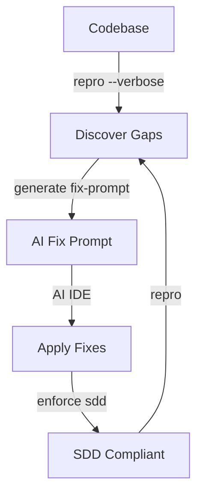

**Decision Points**:

- **After `repro --verbose`**: Review discovered gaps and prioritize fixes.
- **Fix application**: Review AI-suggested fixes before applying.
- **SDD enforcement**: Ensure compliance after fixes are applied.

**Expected Outcomes**:

- Gaps discovered and documented
- Fixes applied via AI assistance
- SDD-compliant codebase

**Related Guides**:

- [AI IDE Workflow](ai-ide-workflow.md) - AI IDE integration
- [Troubleshooting](troubleshooting.md) - Common issues and fixes

---

## 11. SDD Constitution Management Chain

**Goal**: Manage Spec-Driven Development (SDD) constitutions for Spec-Kit compatibility.

**When to use**: You're working with Spec-Kit format and need to bootstrap, enrich, or validate constitutions.

**Command Sequence**:

```bash
# Step 1: Bootstrap constitution from repository
specfact sdd constitution bootstrap --repo .

# Step 2: Enrich constitution with repository context
specfact sdd constitution enrich --repo .

# Step 3: Validate constitution completeness
specfact sdd constitution validate

# Step 4: List SDD manifests
specfact sdd list
```

**Workflow Diagram**:

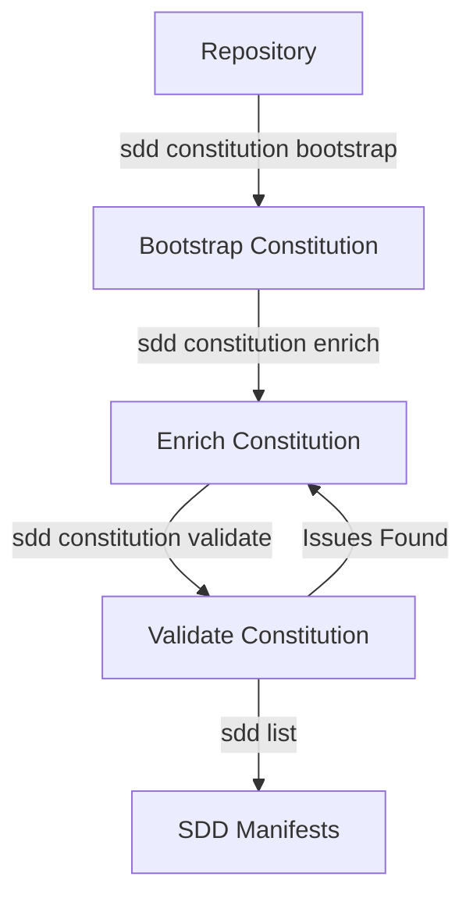

**Decision Points**:

- **Bootstrap vs Enrich**: Use `bootstrap` for new constitutions, `enrich` for existing ones.
- **Validation**: Run validation after bootstrap/enrich to ensure completeness.
- **Spec-Kit Compatibility**: These commands are for Spec-Kit format only. SpecFact uses modular project bundles internally.

**Expected Outcomes**:

- Complete SDD constitution for Spec-Kit compatibility
- Validated constitution ready for use
- List of SDD manifests in repository

**Related Guides**:

- [Spec-Kit Journey](speckit-journey.md) - Spec-Kit integration
- [SDD Constitution Commands](../reference/commands.md#sdd-constitution---manage-project-constitutions) - Command reference

---

## Orphaned Commands Integration

The following commands are now integrated into documented workflows:

### `plan update-idea`

**Integrated into**: [Greenfield Planning Chain](#2-greenfield-planning-chain)

**When to use**: Update feature ideas during planning phase.

**Workflow**: Use as part of `plan update-feature` workflow in Greenfield Planning.

---

### `project export/import/lock/unlock`

**Integrated into**: [Team Collaboration Workflow](team-collaboration-workflow.md) and [Plan Promotion & Release Chain](#5-plan-promotion--release-chain)

**When to use**: Team collaboration with persona-based workflows.

**Workflow**: See [Team Collaboration Workflow](team-collaboration-workflow.md) for complete workflow.

---

### `migrate *` Commands

**Integrated into**: [Migration Guide](migration-guide.md)

**When to use**: Migrating between versions or from other tools.

**Workflow**: See [Migration Guide](migration-guide.md) for decision tree and workflows.

---

### `sdd list`

**Integrated into**: [SDD Constitution Management Chain](#10-sdd-constitution-management-chain)

**When to use**: List SDD manifests in repository.

**Workflow**: Use after constitution management to verify manifests.

---

### `contract verify`

**Integrated into**: [API Contract Development Chain](#4-api-contract-development-chain)

**When to use**: Verify contracts at runtime.

**Workflow**: Use as final step in API Contract Development Chain.

---

## See Also

- [Common Tasks Index](common-tasks.md) - Quick reference for "How do I X?" questions
- [Command Reference](../reference/commands.md) - Complete command documentation
- [Agile/Scrum Workflows](agile-scrum-workflows.md) - Team collaboration patterns
- [Brownfield Engineer Guide](brownfield-engineer.md) - Legacy modernization guide
- [Sidecar Validation Guide](sidecar-validation.md) - Validate external codebases
- [Spec-Kit Journey](speckit-journey.md) - Spec-Kit integration
- [OpenSpec Journey](openspec-journey.md) - OpenSpec integration
- [Team Collaboration Workflow](team-collaboration-workflow.md) - Team collaboration guide
- [Migration Guide](migration-guide.md) - Migration decision tree
