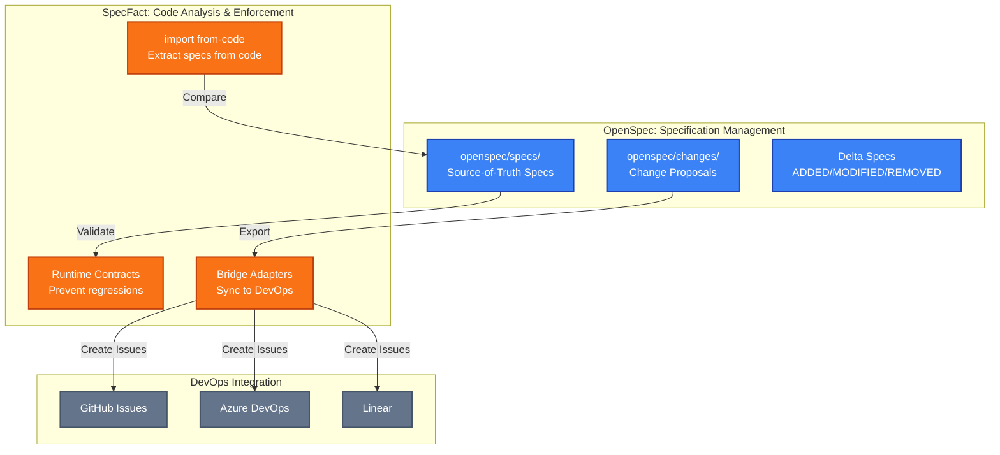
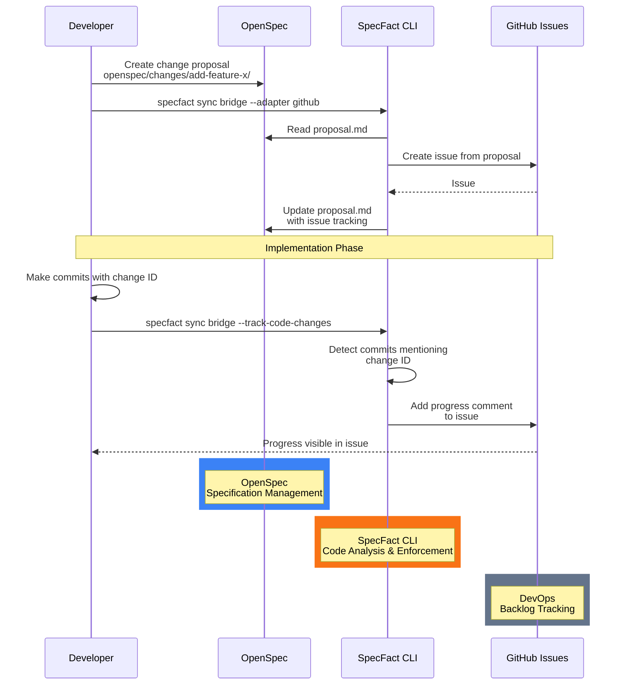
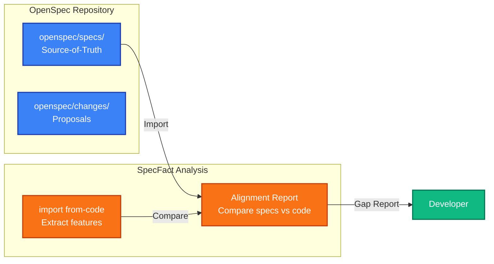
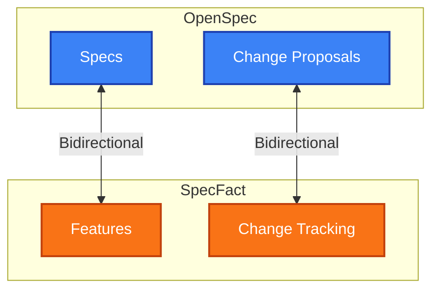
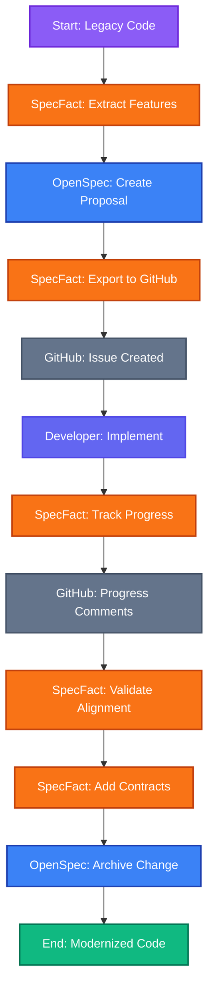

# The Journey: OpenSpec + SpecFact Integration

> **OpenSpec and SpecFact are complementary, not competitive.**  
> **Primary Use Case**: OpenSpec for specification anchoring and change tracking  
> **Secondary Use Case**: SpecFact adds brownfield analysis, runtime enforcement, and DevOps integration

---

## 🎯 Why Integrate?

### **What OpenSpec Does Great**

OpenSpec is **excellent** for:

- ✅ **Specification Anchoring** - Source-of-truth specifications (`openspec/specs/`) that document what IS built
- ✅ **Change Tracking** - Delta specs (ADDED/MODIFIED/REMOVED) that document what SHOULD change
- ✅ **Change Proposals** - Structured proposals (`openspec/changes/`) with rationale, impact, and tasks
- ✅ **Cross-Repository Support** - Specifications can live in separate repositories from code
- ✅ **Spec-Driven Development** - Clear workflow: proposal → delta specs → implementation → archive
- ✅ **Team Collaboration** - Shared specifications and change proposals for coordination

**Note**: OpenSpec excels at **managing specifications and change proposals** - it provides the "what" and "why" for changes, but doesn't analyze existing code or enforce contracts.

### **What OpenSpec Is Designed For (vs. SpecFact CLI)**

OpenSpec **is designed primarily for**:

- ✅ **Specification Management** - Source-of-truth specs (`openspec/specs/`) and change proposals (`openspec/changes/`)
- ✅ **Change Tracking** - Delta specs (ADDED/MODIFIED/REMOVED) that document proposed changes
- ✅ **Cross-Repository Workflows** - Specifications can be in different repos than code
- ✅ **Spec-Driven Development** - Clear proposal → implementation → archive workflow

OpenSpec **is not designed primarily for** (but SpecFact CLI provides):

- ⚠️ **Brownfield Analysis** - **Not designed for reverse-engineering from existing code**
  - OpenSpec focuses on documenting what SHOULD be built (proposals) and what IS built (specs)
  - **This is where SpecFact CLI complements OpenSpec** 🎯
- ⚠️ **Runtime Contract Enforcement** - Not designed for preventing regressions with executable contracts
- ⚠️ **Code2Spec Extraction** - Not designed for automatically extracting specs from legacy code
- ⚠️ **DevOps Integration** - Not designed for syncing change proposals to GitHub Issues, ADO, Linear, Jira
- ⚠️ **Automated Validation** - Not designed for CI/CD gates or automated contract validation
- ⚠️ **Symbolic Execution** - Not designed for discovering edge cases with CrossHair

### **When to Integrate**

| Need | OpenSpec Solution | SpecFact Solution |
|------|------------------|-------------------|
| **Work with existing code** ⭐ **PRIMARY** | ⚠️ **Not designed for** - Focuses on spec authoring | ✅ **`import from-code`** ⭐ - Reverse-engineer existing code to plans (PRIMARY use case) |
| **Sync change proposals to DevOps** | ⚠️ **Not designed for** - Manual process | ✅ **`sync bridge --adapter github`** ✅ - Export proposals to GitHub Issues (IMPLEMENTED) |
| **Track code changes** | ⚠️ **Not designed for** - Manual tracking | ✅ **`--track-code-changes`** ✅ - Auto-detect commits and add progress comments (IMPLEMENTED) |
| **Runtime enforcement** | Manual validation | ✅ **Contract enforcement** - Prevent regressions with executable contracts |
| **Code vs spec alignment** | Manual comparison | ✅ **Alignment reports** ⏳ - Compare SpecFact features vs OpenSpec specs (PLANNED) |
| **Brownfield modernization** | Manual spec authoring | ✅ **Brownfield analysis** ⭐ - Extract specs from legacy code automatically |

---

## 🌱 The Integration Vision

### **Complete Brownfield Modernization Stack**

When modernizing legacy code, you can use **both tools together** for maximum value:



**The Power of Integration:**

1. **OpenSpec** manages specifications and change proposals (the "what" and "why")
2. **SpecFact** analyzes existing code and enforces contracts (the "how" and "safety")
3. **Bridge Adapters** sync change proposals to DevOps tools (the "tracking")
4. **Together** they form a complete brownfield modernization solution

---

## 🚀 The Integration Journey

### **Stage 1: DevOps Export** ✅ **IMPLEMENTED**

**Time**: < 5 minutes

**What's Available Now:**

Export OpenSpec change proposals to GitHub Issues and track implementation progress:

```bash
# Step 1: Create change proposal in OpenSpec
mkdir -p openspec/changes/add-feature-x
cat > openspec/changes/add-feature-x/proposal.md << 'EOF'
# Change: Add Feature X

## Why
Add new feature X to improve user experience.

## What Changes
- Add API endpoints
- Update database schema
- Add frontend components

## Impact
- Affected specs: api, frontend
- Affected code: src/api/, src/frontend/
EOF

# Step 2: Export to GitHub Issues
specfact sync bridge --adapter github --mode export-only \
  --repo-owner your-org \
  --repo-name your-repo \
  --repo /path/to/openspec-repo
```

**What You Get:**

- ✅ **Issue Creation** - OpenSpec change proposals become GitHub Issues automatically
- ✅ **Progress Tracking** - Code changes detected and progress comments added automatically
- ✅ **Content Sanitization** - Protect internal information when syncing to public repos
- ✅ **Separate Repository Support** - OpenSpec proposals and source code can be in different repos

**Visual Flow:**



**Key Insight**: OpenSpec proposals become actionable DevOps backlog items automatically!

---

### **Stage 2: OpenSpec Bridge Adapter** ✅ **IMPLEMENTED**

**Time**: Available now (v0.22.0+)

**What's Available:**

Read-only sync from OpenSpec to SpecFact for change proposal tracking:

```bash
# Sync OpenSpec change proposals to SpecFact
specfact sync bridge --adapter openspec --mode read-only \
  --bundle my-project \
  --repo /path/to/openspec-repo

# The adapter reads OpenSpec change proposals from openspec/changes/
# and syncs them to SpecFact change tracking
```

**What You Get:**

- ✅ **Change Proposal Import** - OpenSpec change proposals synced to SpecFact bundles
- ✅ **Change Tracking** - Track OpenSpec proposals in SpecFact format
- ✅ **Read-Only Sync** - Import from OpenSpec without modifying OpenSpec files
- ⏳ **Alignment Reports** - Compare OpenSpec specs vs code-derived features (planned)
- ⏳ **Gap Detection** - Identify OpenSpec specs not found in code (planned)
- ⏳ **Coverage Calculation** - Measure how well code matches specifications (planned)

**Visual Flow:**



**Key Insight**: Validate that your code matches OpenSpec specifications automatically!

---

### **Stage 3: Bidirectional Sync** ⏳ **PLANNED**

**Time**: Future enhancement

**What's Coming:**

Full bidirectional sync between OpenSpec and SpecFact:

```bash
# Bidirectional sync (future)
specfact sync bridge --adapter openspec --bidirectional \
  --bundle my-project \
  --repo /path/to/openspec-repo \
  --watch
```

**What You'll Get:**

- ⏳ **Spec Sync** - OpenSpec specs ↔ SpecFact features
- ⏳ **Change Sync** - OpenSpec proposals ↔ SpecFact change tracking
- ⏳ **Conflict Resolution** - Automatic conflict resolution with priority rules
- ⏳ **Watch Mode** - Real-time sync as files change

**Visual Flow:**



**Key Insight**: Keep OpenSpec and SpecFact in perfect sync automatically!

---

## 📋 Complete Workflow Example

### **Brownfield Modernization with OpenSpec + SpecFact**

Here's how to use both tools together for legacy code modernization:

```bash
# Step 1: Analyze legacy code with SpecFact
specfact import from-code legacy-api --repo ./legacy-app
# → Extracts features from existing code
# → Creates SpecFact bundle: .specfact/projects/legacy-api/

# Step 2: Create OpenSpec change proposal
mkdir -p openspec/changes/modernize-api
cat > openspec/changes/modernize-api/proposal.md << 'EOF'
# Change: Modernize Legacy API

## Why
Legacy API needs modernization for better performance and maintainability.

## What Changes
- Refactor API endpoints
- Add contract validation
- Update database schema

## Impact
- Affected specs: api, database
- Affected code: src/api/, src/db/
EOF

# Step 3: Export proposal to GitHub Issues ✅ IMPLEMENTED
specfact sync bridge --adapter github --mode export-only \
  --repo-owner your-org \
  --repo-name your-repo \
  --repo /path/to/openspec-repo

# Step 4: Implement changes
git commit -m "feat: modernize-api - refactor endpoints"

# Step 5: Track progress ✅ IMPLEMENTED
specfact sync bridge --adapter github --mode export-only \
  --repo-owner your-org \
  --repo-name your-repo \
  --track-code-changes \
  --repo /path/to/openspec-repo \
  --code-repo /path/to/source-code-repo

# Step 6: Sync OpenSpec change proposals ✅ AVAILABLE
specfact sync bridge --adapter openspec --mode read-only \
  --bundle legacy-api \
  --repo /path/to/openspec-repo
# → Generates alignment report
# → Shows gaps between OpenSpec specs and code

# Step 7: Add runtime contracts
specfact enforce stage --preset balanced

# Step 8: Archive completed change
openspec archive modernize-api
```

**Complete Flow:**



---

## 🎯 Implementation Status

### ✅ **Implemented Features**

| Feature | Status | Description |
|---------|--------|-------------|
| **DevOps Export** | ✅ **Available** | Export OpenSpec change proposals to GitHub Issues |
| **Code Change Tracking** | ✅ **Available** | Detect commits and add progress comments automatically |
| **Content Sanitization** | ✅ **Available** | Protect internal information for public repos |
| **Separate Repository Support** | ✅ **Available** | OpenSpec proposals and source code in different repos |
| **Progress Comments** | ✅ **Available** | Automated progress comments with commit details |

### ⏳ **Planned Features**

| Feature | Status | Description |
|---------|--------|-------------|
| **OpenSpec Bridge Adapter** | ✅ **Available** | Read-only sync from OpenSpec to SpecFact (v0.22.0+) |
| **Alignment Reports** | ⏳ **Planned** | Compare OpenSpec specs vs code-derived features |
| **Specification Import** | ⏳ **Planned** | Import OpenSpec specs into SpecFact bundles |
| **Bidirectional Sync** | ⏳ **Future** | Full bidirectional sync between OpenSpec and SpecFact |
| **Watch Mode** | ⏳ **Future** | Real-time sync as files change |

---

## 💡 Key Insights

### **The "Aha!" Moment**

**OpenSpec** = The "what" and "why" (specifications and change proposals)  
**SpecFact** = The "how" and "safety" (code analysis and contract enforcement)  
**Together** = Complete brownfield modernization solution

### **Why This Integration Matters**

1. **OpenSpec** provides structured change proposals and source-of-truth specifications
2. **SpecFact** extracts features from legacy code and enforces contracts
3. **Bridge Adapters** sync proposals to DevOps tools for team visibility
4. **Alignment Reports** (planned) validate that code matches specifications

### **The Power of Separation**

- **OpenSpec Repository**: Specifications and change proposals (the "plan")
- **Source Code Repository**: Actual implementation (the "code")
- **SpecFact**: Bridges the gap between plan and code

This separation enables:

- ✅ **Cross-Repository Workflows** - Specs in one repo, code in another
- ✅ **Team Collaboration** - Product owners manage specs, developers implement code
- ✅ **Clear Separation of Concerns** - Specifications separate from implementation

---

## See Also

### Related Guides

- [Integrations Overview](integrations-overview.md) - Overview of all SpecFact CLI integrations

- [Command Chains Reference](command-chains.md) - Complete workflows including [External Tool Integration Chain](command-chains.md#3-external-tool-integration-chain)
- [Common Tasks Index](common-tasks.md) - Quick reference for OpenSpec integration tasks
- [DevOps Adapter Integration](devops-adapter-integration.md) - GitHub Issues and backlog tracking
- [Team Collaboration Workflow](team-collaboration-workflow.md) - Team collaboration patterns

### Related Commands

- [Command Reference - Import Commands](../reference/commands.md#import---import-from-external-formats) - `import from-bridge` reference
- [Command Reference - Sync Commands](../reference/commands.md#sync-bridge) - `sync bridge` reference
- [Command Reference - DevOps Adapters](../reference/commands.md#sync-bridge) - Adapter configuration

### Related Examples

- [OpenSpec Integration Examples](../examples/) - Real-world integration examples

### Getting Started

- [Getting Started](../getting-started/README.md) - Quick setup guide
- [Architecture](../reference/architecture.md) - System architecture and design

---

## 📚 Next Steps

### **Try It Now** ✅

1. **[DevOps Adapter Integration Guide](devops-adapter-integration.md)** - Export OpenSpec proposals to GitHub Issues
2. **[Commands Reference](../reference/commands.md#sync-bridge)** - Complete `sync bridge` documentation
3. **[OpenSpec Documentation](https://github.com/nold-ai/openspec)** - Learn OpenSpec basics

### **Available Now** ✅

1. **OpenSpec Bridge Adapter** - Read-only sync for change proposal tracking (v0.22.0+)

### **Coming Soon** ⏳

1. **Alignment Reports** - Compare OpenSpec specs vs code-derived features
2. **Bidirectional Sync** - Keep OpenSpec and SpecFact in sync
3. **Watch Mode** - Real-time synchronization

---

## 🔗 Related Documentation

- **[DevOps Adapter Integration](devops-adapter-integration.md)** - GitHub Issues and backlog tracking
- **[Spec-Kit Journey](speckit-journey.md)** - Similar guide for Spec-Kit integration
- **[Brownfield Engineer Guide](brownfield-engineer.md)** - Complete brownfield modernization workflow
- **[Commands Reference](../reference/commands.md)** - Complete command documentation

---

**Need Help?**

- 💬 [GitHub Discussions](https://github.com/nold-ai/specfact-cli/discussions)
- 🐛 [GitHub Issues](https://github.com/nold-ai/specfact-cli/issues)
- 📧 [hello@noldai.com](mailto:hello@noldai.com)

---

**Remember**: OpenSpec manages specifications, SpecFact analyzes code. Together they form a complete brownfield modernization solution! 🚀
