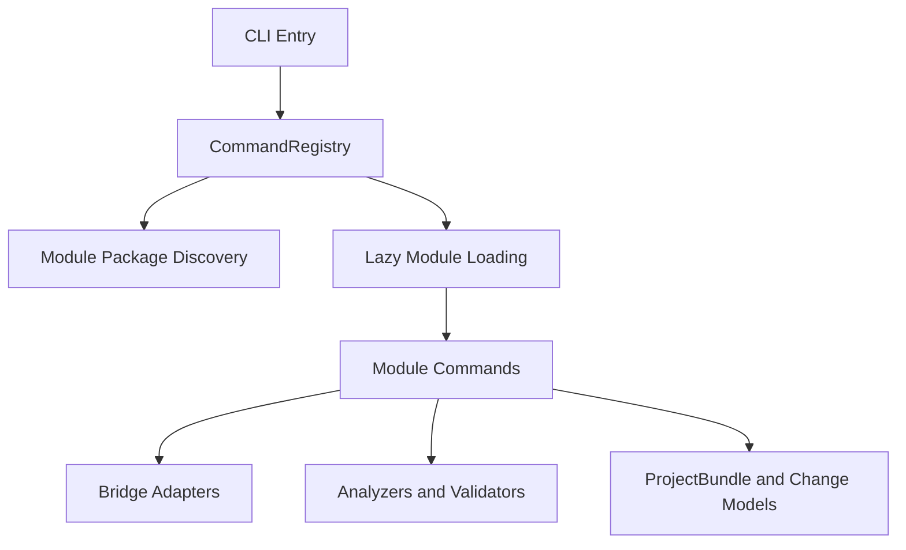

# Architecture

SpecFact CLI is a contract-first Python CLI with a production-ready module registry and bridge-based integration layer.

## Current Architecture Status

- Module system is **production-ready** (introduced in `v0.27`) and is the default command-loading path.
- An architecture command group is **planned** and tracked in OpenSpec change `architecture-01-solution-layer`; it is not part of the current mounted CLI.
- Protocol FSM modeling exists in data models; a full runtime FSM engine is still planned.

## Layer Model

SpecFact is organized as three core quality layers plus supporting implementation layers:

1. Specification layer: `ProjectBundle` models and protocol specs.
2. Contract layer: runtime contracts (`@icontract`, `@beartype`) plus type checks.
3. Enforcement layer: CLI/workflow quality gates and validation orchestration.
4. Adapter layer: external integration via `BridgeAdapter` implementations.
5. Analysis layer: analyzers and validators for repository and backlog intelligence.
6. Module layer: command modules discovered and loaded through the registry.

## Command Registry and Module System

The command runtime uses lazy loading through `CommandRegistry` in `src/specfact_cli/registry/registry.py`:

- Registration stores command metadata and loader callables.
- `get_typer()` loads module Typer apps on first use and caches them.
- Help/list operations use metadata without importing every module.
- `register_builtin_commands()` wires module packages from discovery.

Module discovery and registration logic lives in `src/specfact_cli/registry/module_packages.py` and reads module manifests from `module-package.yaml`.

### Module package structure

Canonical package structure used by current modules:

```text
src/specfact_cli/modules/<module-name>/
  module-package.yaml
  src/
    __init__.py
    app.py
    commands.py
```

For externalized module development (workspace-level modules), the same manifest and source conventions apply.

### `module-package.yaml` fields

Common manifest fields:

- Required: `name`, `version`, `commands`
- Common optional: `command_help`, `pip_dependencies`, `module_dependencies`, `core_compatibility`, `tier`, `addon_id`
- Extension/security optional: `schema_extensions`, `service_bridges`, `publisher`, `integrity`

See also:
- [Module Development Guide](/authoring/module-development/)
- [Module Contracts](module-contracts.md)
- [Module Security](module-security.md)

## Operational Modes

Mode detection currently exists via `src/specfact_cli/modes/detector.py` and CLI flags.

Detection order:

1. Explicit `--mode`
2. Environment/context-based detection
3. Fallback to `cicd`

Current implementation note:

- Mode **detection is implemented**.
- Some advanced mode-specific behavior remains roadmap/planned and is tracked in OpenSpec.
- Implemented-vs-planned details are tracked in OpenSpec change `architecture-01-solution-layer`.

## Adapter Architecture

Bridge integration is defined by `BridgeAdapter` in `src/specfact_cli/adapters/base.py`.

### Required adapter interface

All adapters implement:

- `detect(repo_path, bridge_config=None) -> bool`
- `get_capabilities(repo_path, bridge_config=None) -> ToolCapabilities`
- `import_artifact(artifact_key, artifact_path, project_bundle, bridge_config=None) -> None`
- `export_artifact(artifact_key, artifact_data, bridge_config=None) -> Path | dict`
- `generate_bridge_config(repo_path) -> BridgeConfig`
- `load_change_tracking(bundle_dir, bridge_config=None) -> ChangeTracking | None`
- `save_change_tracking(bundle_dir, change_tracking, bridge_config=None) -> None`
- `load_change_proposal(bundle_dir, change_name, bridge_config=None) -> ChangeProposal | None`
- `save_change_proposal(bundle_dir, proposal, bridge_config=None) -> None`

### Tool capabilities and adapter selection

`ToolCapabilities` is defined in `src/specfact_cli/models/capabilities.py` and includes:

- `tool`, `version`, `layout`, `specs_dir`
- `supported_sync_modes`
- `has_external_config`, `has_custom_hooks`

`BridgeProbe`/sync flows use detection and capabilities to select adapters and choose sync behavior safely.

See also:
- [Adapter Development Guide](/authoring/adapter-development/)
- [Bridge Registry](bridge-registry.md)

## Change Tracking and Protocol Scope

- Change tracking models exist and are used by adapter flows.
- Support is adapter-dependent and not uniformly complete across all external systems.
- Protocol specs exist as models/spec artifacts; full FSM execution and guard engine behavior is not yet fully implemented.

Status and roadmap references:

- OpenSpec change `architecture-01-solution-layer`

## Error Handling Conventions

Architecture-level error handling conventions:

- Raise specific exceptions (`ValueError`, adapter-specific runtime errors) with actionable context.
- Validate public API inputs using `@icontract` and `@beartype`.
- Use bridge logger via `specfact_cli.common.get_bridge_logger` for non-fatal lifecycle and adapter failures.
- Keep module lifecycle resilient: malformed optional metadata is skipped with warnings instead of crashing the CLI.
- In command paths, prefer structured and user-oriented error output over raw trace text.

## Component Overview



## Terminology

- `ProjectBundle`: canonical persisted bundle under `.specfact/projects/<bundle>/`.
- `PlanBundle`: legacy conceptual model references in older docs/code paths.

Use `ProjectBundle` for current architecture descriptions unless explicitly discussing legacy compatibility.

## Architecture Decisions

Formal ADR pages are not yet published on the modules docs site. The current architecture baseline and planned follow-up work are tracked in OpenSpec change `architecture-01-solution-layer`.

## Related Docs

- [Directory Structure](directory-structure.md)
- [Module Development Guide](/authoring/module-development/)
- [Adapter Development Guide](/authoring/adapter-development/)
